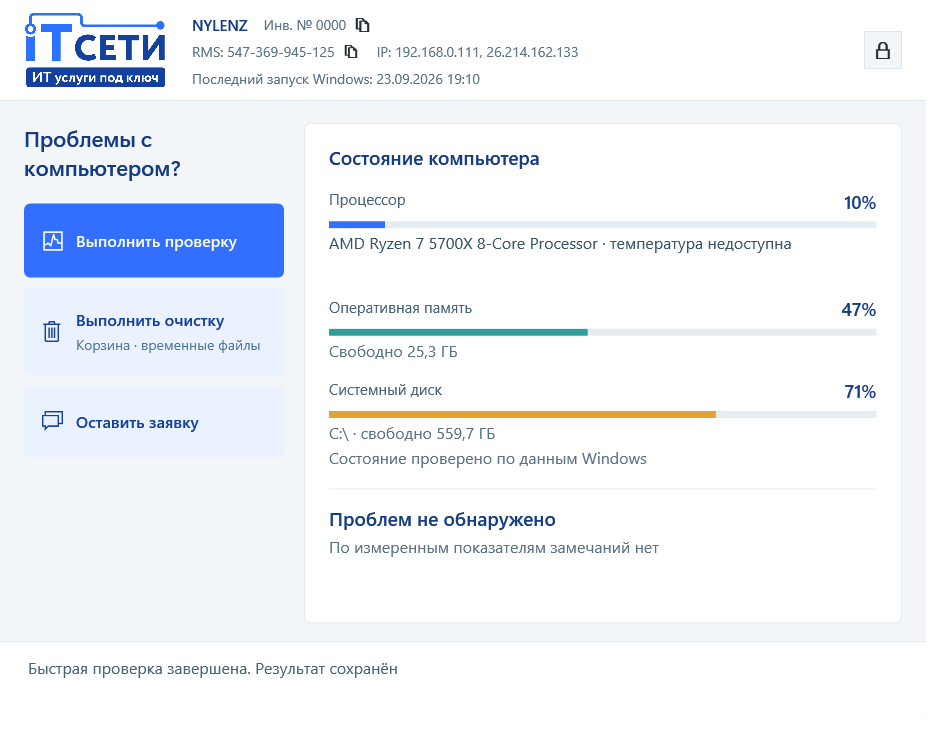

<div align="center">
  
  <h1>Обслуживание ПК ИТ-Сети</h1>
  <p>Диагностика и обслуживание Windows для пользователей и инженеров</p>
</div>



**Текущая версия: 0.9.6** · [Скачать установщик](https://github.com/izivinizi/IT-Seti_client/releases/latest/download/ITSeti-Maintenance-Setup.exe) · [Все релизы](https://github.com/izivinizi/IT-Seti_client/releases)

## Возможности

| Пользователь | Инженер |
| --- | --- |
| Понятная сводка CPU, ОЗУ и системного диска | Полная и ускоренная диагностика компьютера |
| SMART и скорость накопителя без окон тестовых программ | Состояние дисков, SMART, процессы и фильтруемые события Windows |
| Причины возможных проблем простым языком | История проверок, сравнение результатов и отладочные журналы |
| Очистка корзины и временных файлов | Очистка, DISM/SFC, обслуживание и инструменты ИТ-Сети |

## Что проверяет приложение

Пользователь сразу видит нагрузку CPU и памяти, свободное место на системном
диске, температуру процессора и понятные замечания. Проверка оценивает SMART и
скорость накопителя, место на разделах, критические ошибки Windows, активные
процессы вне списка доверенных издателей и время после перезагрузки.

Инженерский режим добавляет подробности оборудования и сети, полную или быструю
диагностику, историю и сравнение результатов, фильтр журнала событий, очистку
Windows, восстановление системных файлов и запуск CrystalDiskInfo,
CrystalDiskMark и TreeSize Free. В истории остаются короткие факты; обнаруженные
между проверками новые процессы показаны последней строкой сравнения.

Проверка обновлений и установка приложения доступны из его интерфейса. Для
запуска утилит с административными правами используется уже повышенный токен
приложения, если он есть; иначе Windows показывает штатный запрос UAC.
Установщик выпускается для Windows x64, а Windows 7 обслуживается отдельной
скриптовой версией.

## Установка и сборка

Скачайте `ITSeti-Maintenance-Setup.exe` со страницы
[последнего релиза](https://github.com/izivinizi/IT-Seti_client/releases/latest).
Установка требует прав администратора для регистрации системных задач.
Приложение рассчитано на Windows 10/11 x64; для Windows 7 оставлена отдельная
скриптовая версия.

Исходный код находится в [`ITSeti.Maintenance`](ITSeti.Maintenance/README.md).
Для локальной сборки нужны .NET 9 SDK и Inno Setup 6:

```powershell
dotnet build ITSeti.Maintenance/ITSeti.Maintenance.sln
dotnet run --project ITSeti.Maintenance/tests/ITSeti.Maintenance.Smoke
pwsh -File ITSeti.Maintenance/Build-InstallPackage.ps1
```

В `ITSeti.Maintenance/Tools` включены CrystalDiskInfo, CrystalDiskMark и
TreeSize Free. Условия распространения сторонних компонентов описаны в
[`THIRD-PARTY-NOTICES.md`](ITSeti.Maintenance/THIRD-PARTY-NOTICES.md).
