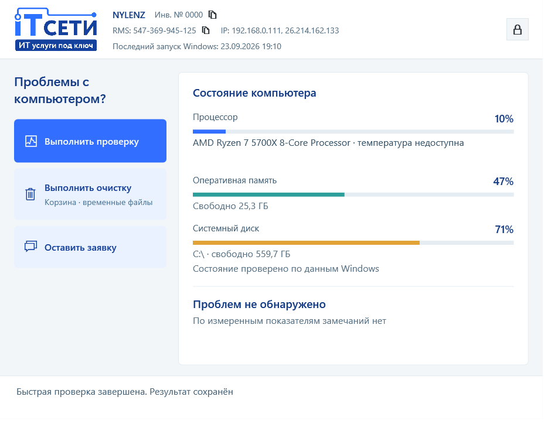
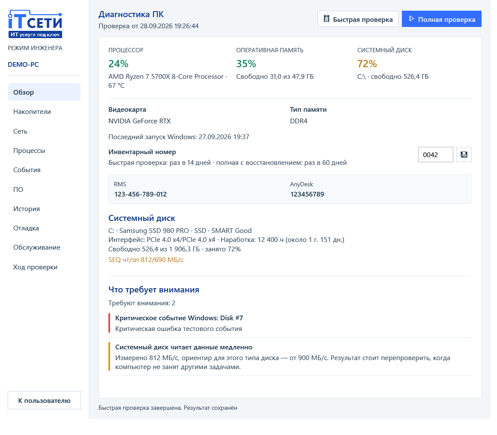

<div align="center">
  
  <h1>Обслуживание ПК ИТ-Сети</h1>
  <p>Диагностика Windows, обслуживание компьютера и инструменты инженера в одном приложении</p>
  <p>
    <a href="https://github.com/izivinizi/IT-Seti_client/releases"><b>Открыть опубликованные выпуски</b></a>
    · <a href="https://github.com/izivinizi/IT-Seti_client/releases/tag/v1.2.2-win7-beta">Windows 7 beta</a>
    · <a href="ITSeti.Maintenance/README.md">Техническая документация</a>
    · <a href="ITSeti.Server/README.md">Центральный сервер (пилот)</a>
    · <a href="ITSeti.Maintenance/THIRD-PARTY-NOTICES.md">Сторонние компоненты</a>
  </p>
  <p><b>Версия исходников: 2.2.0 beta</b> · Windows 10/11 · x64 · отдельная beta-сборка для Windows 7 SP1</p>
</div>

Приложение предназначено для двух сценариев: пользователь может быстро проверить
состояние компьютера и передать поддержке его идентификаторы, а инженер получает
подробную диагностику, историю, обслуживание Windows и инструменты установки ПО.

Результаты проверок хранятся локально. При настроенном подключении к центральному
серверу приложение может отправлять туда диагностический отчёт для просмотра и
сравнения; без подключения работа остаётся локальной.





## Навигация

- [Установка и первый запуск](#установка-и-первый-запуск)
- [Пользовательское окно](#пользовательское-окно)
- [Вход инженера](#вход-инженера)
- [Вкладки инженера](#вкладки-инженера)
- [Как читать результаты](#как-читать-результаты)
- [Плановые действия и обновление](#плановые-действия-и-обновление)
- [Файлы и приватность](#файлы-и-приватность)
- [Сборка из исходников](#сборка-из-исходников)
- [Центральный сервер](#центральный-сервер)

## Центральный сервер

В 2.2 добавлены обновлённые окна заявок, автоматический опрос публичных ответов
с уведомлениями через трей и веб-интеграция Okdesk без API-токена. Проверены
создание заявки, исходящие вложения и публичные/скрытые комментарии; API-вариант
сохранён. Смена статусов через веб-вход и импорт вложений, добавленных прямо в
Okdesk, пока не реализованы. В Windows 7 заявки намеренно отсутствуют;
автотесты Win7-порта на современной ОС не заменяют проверку на Windows 7 SP1.

В отдельном проекте [ITSeti.Server](ITSeti.Server/README.md) развёртывается пилот
центрального портала: компьютеры и объекты, история диагностик, сравнение
процессов и событий, каталог ПО и заявки. Клиент поддерживает локальную работу
без сервера и отправку отчётов/заявок при настроенном подключении. Это тестовая
интеграция: перед массовым подключением нужно проверить её на целевом сервере,
резервное восстановление и нагрузку.

## Установка и первый запуск

1. Стабильная линия 1.2 и тестовая линия 2.2 разделены. Актуальный код 2.2.0 находится в ветке [beta](https://github.com/izivinizi/IT-Seti_client/tree/beta); локальный установщик называется `ITSeti-Maintenance-Setup-2.2.exe`. Опубликованные установщики доступны на [странице выпусков](https://github.com/izivinizi/IT-Seti_client/releases). Номер исходников не означает автоматической публикации GitHub Release.
2. Запустите установщик **с правами администратора**. Они нужны при установке для регистрации системных задач обслуживания и обновления.
3. На одном экране выберите папку установки, задайте четырёхзначный инвентарный номер и при необходимости отметьте установку встроенного комплекта ПО ИТ-Сети.
4. Откройте приложение из меню «Пуск» или с рабочего стола. Для обычной пользовательской диагностики вводить пароль администратора не нужно.

Установщик рассчитан на Windows 10/11 x64. Для Windows 7 SP1 доступен отдельный
[beta-установщик](https://github.com/izivinizi/IT-Seti_client/releases/tag/v1.2.2-win7-beta)
для x86 и x64. Он сохраняет диагностику, SMART, плановые задачи SYSTEM и обновление
Win7-клиента; установка ПО в нём отключена. Если доменная политика запрещает создание системных задач,
установщик сохранит подробности в
`C:\ProgramData\ITSeti\Maintenance\install.log`.

## Пользовательское окно

В пользовательском окне три основные кнопки. Справа показаны текущие показатели
процессора, памяти и системного диска; значения обновляются автоматически.

### Выполнить проверку

Запускает полную диагностику без очистки и восстановления Windows. Во время работы
приложение показывает этап проверки и обновляемую сводку, а после завершения сохраняет
результат локально. Проверяются загрузка CPU и ОЗУ, температура процессора, диски,
состояние SMART, скорость системного накопителя, процессы и доступные события Windows.
Дисковые утилиты работают для сбора данных без открытия своих окон пользователю.

В итогах сначала показываются важные замечания и возможные причины замедления.
Если свободного места мало, можно сразу запустить очистку или открыть TreeSize для
анализа выбранного диска. Если Windows не перезагружалась больше шести дней,
приложение предложит перезагрузить компьютер и напомнит сохранить документы;
автоматической перезагрузки не происходит.

### Выполнить очистку

Очищает корзину и временные файлы профиля пользователя. Системная часть включает
доступные временные файлы Windows, кэш эскизов и шейдеров, оптимизацию доставки,
пакеты драйверов и файлы очистки обновлений Windows. Системная очистка выполняется
отдельно, поэтому интерфейс можно закрыть, пока она продолжается.

Очистка не предназначена для удаления документов, загрузок или пользовательских
данных браузеров. После запуска приложение показывает краткий результат; подробный
статус доступен инженеру.

### Оставить заявку

Кнопка **не отправляет заявку автоматически**: она открывает доступные каналы связи
и напоминает приложить сведения о компьютере. Инвентарный номер, RMS ID и публичный
ID AnyDesk можно выделить, копировать по отдельности или собрать кнопкой
**«Копировать всё»**. Подписи и значения находятся в одном поле: можно выделить
мышью весь блок целиком или отдельный фрагмент. Синяя кнопка копирует весь блок.
Адрес электронной почты копируется отдельно.

Доступны бот в [MAX](https://max.ru/id6670529055_bot),
[Telegram](https://t.me/it_seti_support_bot), почта `support@it-seti.ru`
и телефон `+7 (343) 243-57-63` (кнопка 2 в голосовом меню).

## Вход инженера

Нажмите значок замка в правой части заголовка приложения и введите учётную запись
Windows с правами администратора и её пароль. PIN-код Windows Hello не подходит.
Приложение проверяет данные средствами Windows, запускает отдельное инженерское
окно от имени этой учётной записи и не сохраняет пароль. В публичной сборке нет
общего встроенного пароля для входа.

Так пользовательское окно остаётся доступным, а повышенное инженерское окно работает
независимо. Запуск системных инструментов и административные действия зависят от
прав именно того инженерского окна; доменная политика Windows может ограничить их.

Сверху инженерского окна находятся две команды:

- **Быстрая проверка** — полная проверка оборудования и журналов без 30-секундного
  наблюдения нагрузки и без теста скорости диска.
- **Полная проверка** — включает измерение нагрузки и двухпроходный тест диска.
  Ход выполнения и краткие сообщения видны во вкладке «Ход проверки».

## Вкладки инженера

| Вкладка | Для чего нужна | Что смотреть или нажимать |
| --- | --- | --- |
| **Обзор** | Сводка компьютера | Загрузка CPU и ОЗУ, модель процессора, видеокарта, тип памяти DDR, системный диск, RMS и AnyDesk ID, список фактов, требующих внимания. Здесь же можно задать инвентарный номер. |
| **Накопители** | Состояние физических дисков и разделов | Модель и тип HDD/SSD/NVMe, SMART, состояние Windows, режим интерфейса, наработка, место на разделах и результат теста чтения/записи. |
| **Сеть** | Подключения компьютера | Активные адаптеры, тип и состояние линка, скорость соединения и IP-адреса. Список можно обновить кнопкой со значком обновления. |
| **Процессы** | Поиск неизвестного или необычного ПО | Таблица показывает процессы вне встроенного списка доверенных издателей, их понятное название, издателя и статус подписи. Отсутствие издателя само по себе не доказывает вредоносность процесса. |
| **События** | Просмотр журнала Windows | По умолчанию отображаются критические события. Фильтр позволяет добавить ошибки или показать все уровни; выберите строку, чтобы прочитать её описание. |
| **ПО** | Программы ИТ-Сети и диагностические утилиты | Состояние AnyDesk, RMS, OCS и панели, установка или удаление компонентов, запуск CrystalDiskInfo, CrystalDiskMark и TreeSize, проверка и установка обновления приложения. |
| **История** | Разбор предыдущих запусков | Выберите запись, чтобы увидеть фактические замечания. Нижний блок сравнивает ключевые показатели с предыдущей проверкой, включая изменения места, скорости и новые процессы/ошибки, если данные доступны. |
| **Отладка** | Поиск причины сбоя или неполного результата | Этапы проверки, статус SMART и DiskSpd, текст ошибки и файлы диагностического запуска. Двойной щелчок по файлу открывает его; кнопка папки открывает каталог проверки. |
| **Обслуживание** | Дополнительные действия Windows | Системные приложения, очистка, поиск обновлений Windows, управление автообновлениями, состояние и переключение защиты Microsoft Defender, запуск DISM/SFC и просмотр их результата. |
| **Ход проверки** | Текущий запуск диагностики | Последовательность этапов и сообщения по дискам и обслуживанию. Используйте эту вкладку, если нужно понять, что именно сейчас выполняется. |

Синий экран, отражённый в событии Kernel-Power 41 с ненулевым `BugcheckCode`,
показывается в пользовательской сводке как критическая ошибка с номером и причиной.
Справочник из 379 кодов Microsoft встроен в приложение и работает без интернета;
для неизвестного или нестандартного кода сохраняется его номер.

### Вкладка «ПО» подробнее

В верхней части отображается состояние программ и встроенного комплекта установочных
файлов. Комплект `ITSETI-Setup` поставляется внутри приложения и не требует флешки,
выбора внешней папки или отдельного установщика. Кнопка проверки обновляет сведения
о состоянии программ; для компонентов доступны индивидуальные действия. **«Установить всё»**
устанавливает комплект ИТ-Сети, WinRAR и Яндекс Браузер.

Блок дисковых утилит:

- **CrystalDiskInfo** — SMART и сводное здоровье накопителей.
- **CrystalDiskMark** — ручной запуск графического теста скорости.
- **TreeSize** — анализ выбранного тома, чтобы найти каталоги, занимающие место.
- **Каталог утилит** — открыть папку включённых в приложение утилит.

Ниже находится блок обновления самого приложения. Сначала нажмите **«Проверить
обновления»**, затем **«Обновить из GitHub»**, если новая версия доступна. Перед
установкой проверяются размер и SHA-256 пакета. После загрузки приложение закроется
для замены файлов; отдельное окно покажет установку и её результат.

### Вкладка «Обслуживание» подробнее

Системные ярлыки включают доступные на этой версии Windows средства администрирования:
«Управление компьютером», групповые политики, терминал, панель управления,
«Параметры», параметры сетевых адаптеров и сведения о системе. Часть ярлыков может
отсутствовать в конкретной редакции Windows.

Очистка и восстановление запускаются отдельно от диагностики. DISM/SFC могут работать
долго; результат и журнал можно проверить позже. Для Windows Update доступны поиск
обновлений, отключение автоматической установки и возврат сохранённой настройки.
Доменные политики могут иметь приоритет над локальными параметрами.

Microsoft Defender можно переключить только в инженерском окне с правами администратора.
Изменяется защита в реальном времени; приложение не обходит Tamper Protection и
политики организации. Если Windows запрещает действие, состояние останется без
изменений и приложение покажет отказ.

## Как читать результаты

Замечания — это сигналы для проверки, а не автоматический диагноз. Учитывайте модель
компьютера, тип накопителя и текущую нагрузку.

| Показатель | Как трактуется |
| --- | --- |
| CPU и ОЗУ | Устойчивая средняя загрузка около 90% за 30 секунд считается высокой; краткий скачок не равен постоянной перегрузке. Менее 4 ГБ ОЗУ отмечается отдельно. При высокой нагрузке памяти показываются наиболее потребляющие процессы. |
| Температура CPU | Выше 80 °C — предупреждение, 90 °C и выше — критический уровень. Если датчик недоступен, приложение показывает это явно и не подставляет температуру другого компонента. |
| Свободное место | Менее 15 ГБ — предупреждение, менее 5 ГБ — критический уровень. При нехватке места можно запустить очистку или сканирование TreeSize. |
| Скорость диска | Результат зависит от интерфейса и фоновой нагрузки. Для SATA SSD ориентиры предупреждения/критического уровня — 210/180 МБ/с чтения; для HDD — 100/80 МБ/с. Для NVMe используется ориентир 900 МБ/с. Скорость записи справочная. |
| Накопитель | Тревожный SMART, подтверждённое ограничение интерфейса и наработка выше 60 000 часов выводятся как отдельные замечания. HDD может быть медленнее SSD даже при исправном состоянии. |
| Windows | Сборка ниже 1809 (18H2) отмечается как устаревшая. |

Одно или два события Kernel-Power 41 с `BugcheckCode: 0` не считаются ошибкой:
обычно это соответствует принудительному выключению. При трёх и более таких
событиях они снова попадают в список критических событий. Исходные события
остаются видны инженеру во вкладке «События».

Тест скорости выполняется на системном диске и временном тестовом файле. Приложение
показывает ошибку вместо выдуманного результата, если тест не удалось выполнить.
Для HDD допустимы колебания скорости; перед сравнением результатов закройте тяжёлые
задачи и учитывайте модель диска.

## Плановые действия и обновление

- Быстрая проверка раз в 14 дней запускается скрытой задачей Windows от SYSTEM;
  пользовательский сеанс не требуется.
- Полная проверка раз в 60 дней выполняется отдельной задачей SYSTEM. Она не запускает
  обычную очистку. На Windows 10/11 применяются доступные DISM/SFC; на Windows 7
  выполняются диагностика, SMART, тест диска и SFC.
- Если ночная полная проверка завершилась ошибкой, приложение предложит повторить её
  днём. Быстрая проверка не показывает пользователю напоминаний.
- Инженер может отдельно запустить очистку и DISM/SFC. Их выполнение не блокирует
  использование основного окна; статус доступен позднее во вкладке «Обслуживание».
- После ручных и плановых проверок отдельная системная задача проверяет приложение
  на GitHub и при наличии новой версии загружает и устанавливает её в фоне. Перед
  установкой проверяются версия, размер и SHA-256. Для Windows 7 используется свой
  установщик из отдельного beta-релиза.

## Файлы и приватность

- История проверок: `%LOCALAPPDATA%\ITSeti\Maintenance\history.db`.
- Отчёты и журналы запусков: `%LOCALAPPDATA%\ITSeti\Maintenance\Runs`.
- Инвентарный номер и состояние обслуживания: `%ProgramData%\ITSeti\Maintenance`.
- Журнал установки: `C:\ProgramData\ITSeti\Maintenance\install.log`.

Проверки не передают собранные сведения в интернет. Идентификаторы RMS и AnyDesk
считываются локально, чтобы показать их в окне обращения; они не загружаются на GitHub.
GitHub получает только запросы, необходимые для получения версии и установочного
пакета при обновлении.

## Сборка из исходников

Откройте `ITSeti.Maintenance/ITSeti.Maintenance.sln` в Visual Studio 2022 с .NET 9 SDK
или выполните из корня репозитория:

```powershell
dotnet build ITSeti.Maintenance/ITSeti.Maintenance.sln -c Release
dotnet run --project ITSeti.Maintenance/tests/ITSeti.Maintenance.Smoke
powershell.exe -NoProfile -ExecutionPolicy Bypass -File ITSeti.Maintenance/Build-InstallPackage.ps1
```

Для сборки установщика также нужен Inno Setup 6. Подробные сведения об архитектуре,
проверках и ограничениях сборки находятся в
[техническом README проекта](ITSeti.Maintenance/README.md). Условия распространения
сторонних компонентов перечислены в
[THIRD-PARTY-NOTICES.md](ITSeti.Maintenance/THIRD-PARTY-NOTICES.md).
